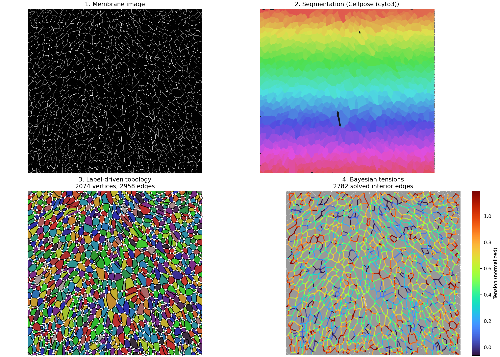
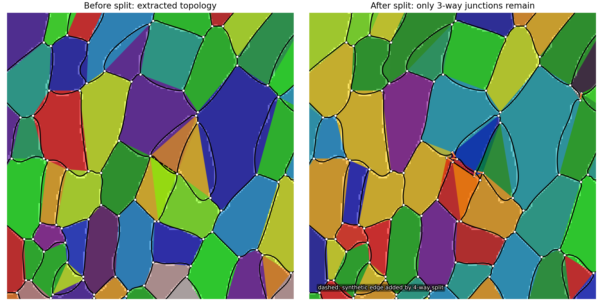
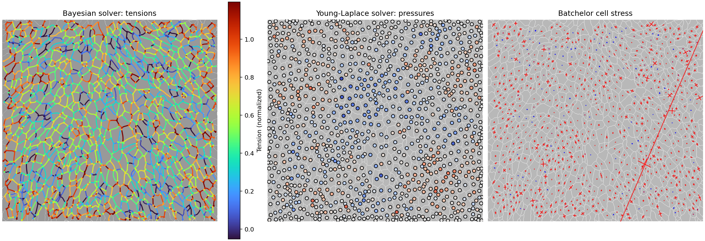
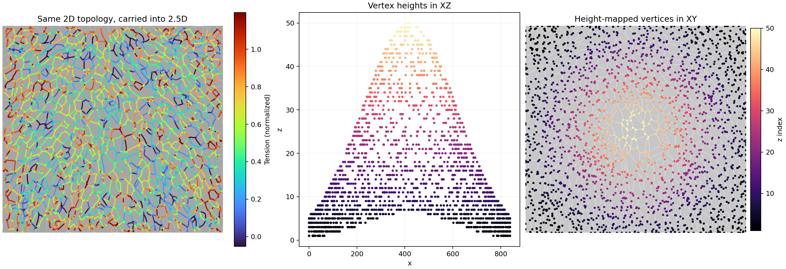

# ForceInferencePy

[](https://github.com/Weiykong/ForceInferencePy/actions/workflows/tests.yml)
[](https://www.python.org/downloads/)
[](LICENSE)

Robust force inference for epithelial tissues, from membrane images to cell-cell tensions, pressures, and stress summaries.

The package is built around a **Cellpose-first segmentation path**, a **label-driven topology extractor** that avoids skeletonization artifacts, and solver pipelines for **Bayesian force inference**, **Young-Laplace inference on curved interfaces**, and **2.5D vertex height mapping**.



## What This Repo Covers

ForceInferencePy takes a microscopy image or segmentation mask and walks it through the full mechanics pipeline:

1. **Segmentation**
   - Preferred: `segment_cellpose(...)`
   - Fallback: `segment_grayscale(...)`
2. **Topology extraction**
   - `extract_topology_label(...)` detects junctions and interfaces directly from label neighborhoods
3. **Topology cleanup**
   - `split_high_degree_vertices(...)` converts unstable 4-way+ junctions into short synthetic edges between 3-way vertices
4. **Geometry**
   - `compute_curvature(...)` traces interfaces, fits curvature, and computes analytical tangents
5. **Mechanics**
   - `solve_bayesian(...)` for robust tension and pressure inference
   - `solve_laplace(...)` for curved-edge force balance
6. **Stress / 2.5D**
   - `calculate_batchelor_stress(...)`
   - `map_z_to_vertices(...)`

## Installation

Core package:

```bash
pip install -e .
```

With Cellpose support:

```bash
pip install -e ".[cellpose]"
```

If you only want to add Cellpose to an existing environment:

```bash
pip install cellpose
```

## Segmentation

`force_inference.segmentation.segment_cellpose` is the recommended entry point for membrane images. The implementation is compatible with modern Cellpose releases by using `models.CellposeModel`, and it exposes the knobs that matter most in practice:

- `model_type`
  - `cyto3` is a good default starting point
  - `cpsam` is available for Cellpose 4 workflows
- `diameter`
  - leave `None` for auto-estimation, or set it when your tissue scale is known
- `flow_threshold`
  - increase to recover harder cells
- `cellprob_threshold`
  - lower it to pick up fainter membranes
- `min_size`
  - reject tiny fragments after segmentation

The older grayscale watershed path is still available as `segment_grayscale(...)`, but it is explicitly treated as a fallback.

```python
from force_inference.segmentation import segment_cellpose

labels, gray = segment_cellpose(
    "data/test.tif",
    model_type="cyto3",
    diameter=None,
    flow_threshold=0.4,
    cellprob_threshold=0.0,
    gpu=False,
)
```

## Topology Extraction

The main topology extractor is **label-driven**, not skeleton-driven:

```python
from force_inference.topology_label import extract_topology_label

tissue = extract_topology_label(
    labels,
    min_edge_len=1,
    use_skeleton_geometry=False,
    collapse_stubs=True,
    collapse_tiny_twins=False,
)
```

Why this matters:

- Skeletonization is geometric, so close junctions can merge.
- Real short interfaces can disappear if the junctions sit only a few pixels apart.
- The label-driven extractor classifies local boundary neighborhoods directly, so every real cell-cell interface is preserved as an edge whenever the labels resolve it.

The pipeline then optionally runs `split_high_degree_vertices(...)` to replace unstable 4-way or higher-order junctions with short synthetic edges between 3-way vertices. This is especially important before curvature fitting and Laplace inference.



For the implementation details behind the extractor, see [QUICK_START.md](QUICK_START.md) and [LABEL_DRIVEN_TOPOLOGY_README.md](LABEL_DRIVEN_TOPOLOGY_README.md).

## Solvers

### Bayesian Solver

`solve_bayesian(...)` solves for tensions and pressures from force balance at vertices, with a prior that stabilizes the inverse problem.

Use it when:

- you want a robust default solver
- your interfaces are noisy or only weakly curved
- you want automatic regularization scanning by leaving `mu=None`

```python
from force_inference.solvers import solve_bayesian

result = solve_bayesian(tissue, mu=1e-2)
```

### Young-Laplace Solver

`solve_laplace(...)` uses fitted curvature and tangents to solve curved-edge force balance. It expects geometry to have been computed first:

```python
from force_inference.geometry import compute_curvature
from force_inference.solvers import solve_laplace

tissue = compute_curvature(tissue)
result = solve_laplace(tissue, regularization=1.0)
```

Use it when:

- the interfaces are visibly curved
- you want pressure differences constrained by Laplace’s law
- you have already handled ambiguous high-degree junctions

### Stress Summaries

After solving, you can derive per-cell stress tensors with `calculate_batchelor_stress(...)` and visualize them with `plot_cell_stress_crosses(...)`.



## 2.5D Support

ForceInferencePy also stores a third coordinate per vertex, so you can carry a height field or volumetric stack into the same tissue graph:

```python
from force_inference.geometry import map_z_to_vertices

tissue = map_z_to_vertices(tissue, stack)
```

This is **2.5D support**, not a full volumetric remeshing pipeline:

- segmentation and topology are still extracted from a 2D label image
- the graph keeps the same connectivity in the image plane
- vertex heights are written into `tissue.V[:, 2]`
- this is useful for side views, height-aware visualization, and downstream analysis

Current solver assembly uses the planar `(x, y)` geometry for force balance, while preserving `z` on vertices for 2.5D workflows.



## End-to-End Example

```python
from force_inference.segmentation import segment_cellpose
from force_inference.topology_label import extract_topology_label
from force_inference.split_four_way import split_high_degree_vertices
from force_inference.geometry import compute_curvature, calculate_batchelor_stress
from force_inference.solvers import solve_bayesian

labels, gray = segment_cellpose("data/test.tif", model_type="cyto3", gpu=False)

tissue = extract_topology_label(
    labels,
    min_edge_len=1,
    use_skeleton_geometry=False,
    collapse_stubs=True,
    collapse_tiny_twins=False,
)
tissue = split_high_degree_vertices(tissue, split_length=4.0)
tissue = compute_curvature(tissue)

result = solve_bayesian(tissue, mu=1e-2)
result = calculate_batchelor_stress(tissue, result)
```

## Examples

- `examples/quickstart.py`
  - shortest path through segmentation, topology extraction, curvature, and Bayesian inference
- `examples/demo_laplace.py`
  - curved-edge inference with 4-way splitting
- `examples/demo_stress_analysis.py`
  - per-cell stress tensors and stress-cross visualization
- `examples/demo_25d_stack.py`
  - mapping a stack onto vertex heights
- `demo_cellpose_pipeline.py`
  - standalone Cellpose-first pipeline script

## Repo Layout

- `force_inference/`
  - core package modules
- `examples/`
  - runnable demos
- `diagnosis/`
  - debugging and diagnostic plots/scripts
- `tests/`
  - regression coverage
- `scripts/generate_readme_assets.py`
  - reproduces the PNG assets used in this README

## Rebuild README Assets

```bash
/opt/homebrew/bin/python3.10 scripts/generate_readme_assets.py
```

The asset script prefers Cellpose and falls back to grayscale segmentation if Cellpose is not available. For a fast local rebuild without Cellpose inference:

```bash
/opt/homebrew/bin/python3.10 scripts/generate_readme_assets.py --skip-cellpose
```

## Testing

```bash
pytest tests/
```

## License

MIT
